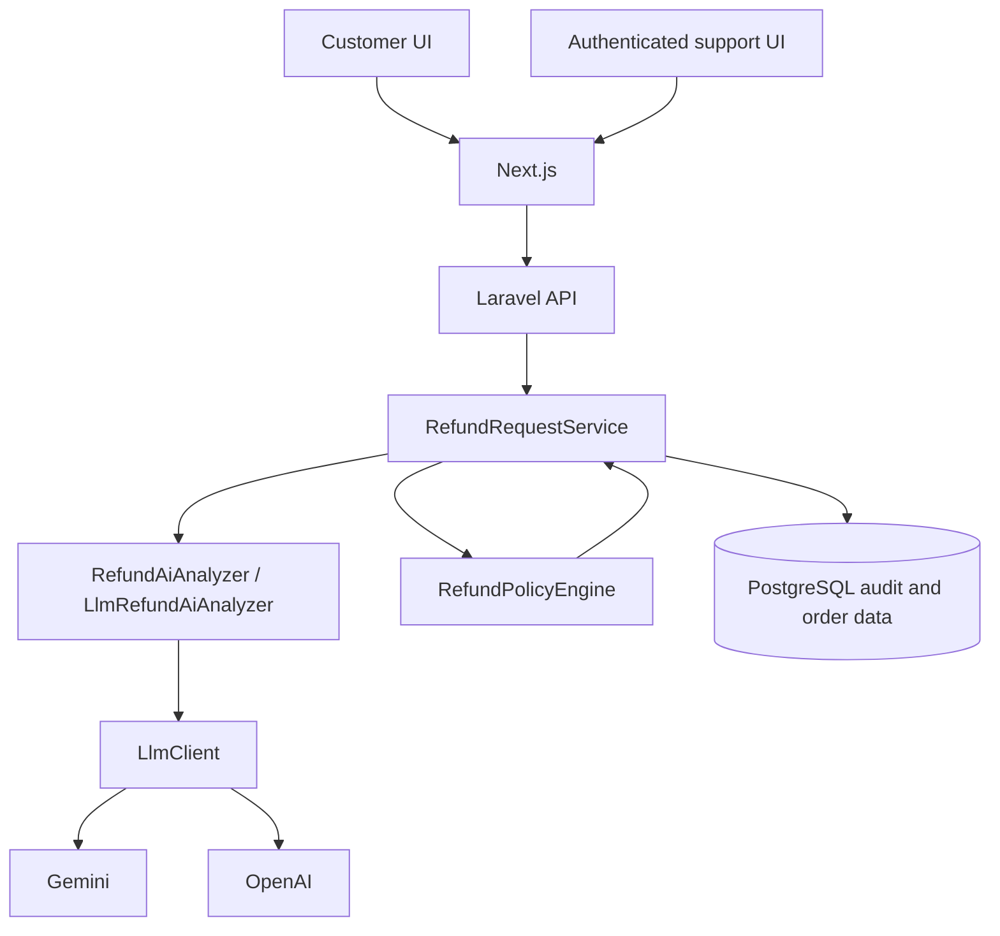

# AI-Powered Customer Support Refund System

## Overview

WORKNOON is a refund-support application with a public customer refund flow and an authenticated support dashboard. AI interprets customer messages and provides advisory analysis. AI never approves or denies a refund; deterministic application policy owns the final outcome.

## Key design decision

The language model classifies the stated issue and returns a summary and risk signals. `RefundPolicyEngine` evaluates server-loaded order facts and those advisory signals to produce the policy result. Provider failure preserves hard policy decisions and escalates requests that need an AI classification for human review.

## Demo video

Demo video link will be added before submission.

## Tech stack

- Laravel 13 API on PHP 8.3
- Next.js 16, React 19, and TypeScript
- PostgreSQL 17
- Docker Compose
- Gemini Generate Content API by default; OpenAI Responses API is also supported

## Architecture



Request processing is: customer message -> AI interpretation -> deterministic policy evaluation -> audit persistence -> final resolution. The policy engine does not delegate business authority to a model.

## Refund policy

The application evaluates rules in this order:

1. Final-sale order -> `DENIED / FINAL_SALE`.
2. Order older than the configured refund window -> `DENIED / REFUND_WINDOW_EXPIRED`.
3. Suspicious signal -> `ESCALATED / SUSPICIOUS_REQUEST`.
4. Conflicting-claims signal -> `ESCALATED / CONFLICTING_CLAIMS`.
5. Requested amount above the configured threshold -> `ESCALATED / HIGH_VALUE_REVIEW`.
6. Damaged item -> `APPROVED / ELIGIBLE_DAMAGED_ITEM`.
7. Incorrect item -> `APPROVED / ELIGIBLE_INCORRECT_ITEM`.
8. Unsupported reason -> `DENIED / UNSUPPORTED_REASON`.

The defaults are a 30-day window and a $500 high-value threshold. Exactly 30 days remains eligible; exactly $500 is not high-value solely because of its amount. Amounts are represented in integer cents for policy comparison. The customer's reason hint is not authoritative: the AI classification is evaluated against order facts loaded by the server. A request amount cannot exceed the order total.

## AI integration

The AI boundary is implemented by `RefundAiAnalyzer`, `LlmRefundAiAnalyzer`, `RefundPromptBuilder`, and the provider-neutral `LlmClient` contract. `GeminiGenerateContentClient` and `OpenAiResponsesClient` implement that contract. Gemini is the configured default. Gemini requests use structured JSON output constrained by a response schema.

The model returns only a classified reason, short summary, suspicious and conflicting-claims flags, confidence, and suggested response. It does not return a refund decision. Customer text is treated as untrusted input, and the prompt says it cannot change the model's role or the application policy. For example, a prompt-injection-containing final-sale request may be classified as damaged, but the application still returns `DENIED / FINAL_SALE`. This illustrates the separation of responsibilities; it is not a universal security guarantee.

For Gemini HTTP 503 responses, the client makes at most three total attempts, waiting about one second and then two seconds between attempts. Other errors do not use this 503 retry sequence. If analysis remains unavailable, provider errors are translated to safe application outcomes: final-sale, expired-window, and high-value policy decisions are preserved; otherwise the request is escalated for human review. Automated tests cover the retry limit and safe fallback. Live provider availability is external and is not guaranteed.

## Security

- Customer text is untrusted model input; the model has no policy authority.
- Raw provider errors are converted to provider-neutral errors and are not shown to customers.
- Customer screens show the outcome, customer-safe explanation, next step, and relevant restrictions. They do not show provider, model, confidence, risk flags, AI status, or internal error codes.
- Ordinary orders show no final-sale label. Final-sale orders show: "Final sale - this item is not refundable."
- Support audit detail retains AI status, provider/model, classification, summary, confidence, risk signals, suggested response, policy evaluation, and final resolution.
- Real credentials belong only in local environment files or a secret manager, never in Git.

## Run locally

Prerequisite: Docker Desktop or Docker Engine with Compose v2. From the repository root, create the local environment file and set a support password:

```sh
cp .env.example .env
```

Set `SUPPORT_PASSWORD` in `.env` to a local password. AI credentials are optional. With no provider key, hard policy outcomes still apply and requests that need AI analysis are escalated for human review.

Start the stack and seed the synthetic demo data:

```sh
docker compose up --build -d
docker compose exec backend php artisan db:seed --force
```

If `APP_KEY` is empty, the backend container generates one at startup before running migrations. Recreating a container with an empty configured key generates a new key and invalidates existing support cookies.

| Service | URL |
|---|---|
| Frontend | <http://localhost:3000> |
| Backend | <http://localhost:8000> |
| Database-aware health check | <http://localhost:8000/api/health> |
| Support login | <http://localhost:3000/support/login> |
| Support dashboard | <http://localhost:3000/support> |

Stop the stack with `docker compose down`. To remove its local PostgreSQL volume as well, use `docker compose down -v`.

## Environment variables

The primary local Docker setup reads variables from the repository-root `.env`. Empty AI keys are supported; a non-empty support password is required for support login.

| Variable | Default | Needed for |
|---|---|---|
| `APP_KEY` | Generated by backend container when empty | Laravel encryption; generated automatically by Docker startup |
| `POSTGRES_DB` | `refund_system` | Basic local app; Compose database |
| `POSTGRES_USER` | `refund_app` | Basic local app; Compose database |
| `POSTGRES_PASSWORD` | Local example value | Basic local app; Compose database |
| `REFUND_WINDOW_DAYS` | `30` | Basic local app; policy setting |
| `REFUND_HIGH_VALUE_THRESHOLD_CENTS` | `50000` | Basic local app; policy setting |
| `AI_PROVIDER` | `gemini` | Optional live AI; `gemini` or `openai` |
| `AI_MODEL` | `gemini-3.8-flash` | Optional live AI; selected provider model |
| `AI_TIMEOUT_SECONDS` | `20` | Optional live AI; provider timeout |
| `GEMINI_API_KEY` | Empty | Optional live Gemini AI |
| `GEMINI_BASE_URL` | Google Generative Language API URL | Optional live Gemini AI; also overridden to local in E2E |
| `OPENAI_API_KEY` | Empty | Optional live OpenAI AI |
| `OPENAI_BASE_URL` | OpenAI API URL | Optional live OpenAI AI |
| `SUPPORT_USERNAME` | `support` | Support login identity |
| `SUPPORT_PASSWORD` | Empty | Required for support login; supply locally |
| `SUPPORT_AUTH_TTL_MINUTES` | `480` | Support login lifetime (clamped to 1-1440 minutes) |
| `SUPPORT_COOKIE_SECURE` | `false` | Set `true` when serving over HTTPS |
| `FRONTEND_URL` | `http://localhost:3000` | Support auth cookie configuration |
| `NEXT_PUBLIC_API_BASE_URL` | `http://localhost:8000` | Frontend API URL in the browser |
| `BACKEND_API_URL` | `http://backend:8000` | Frontend server-side API URL in Compose |

The backend also has its own `.env.example` for direct Laravel development. Docker Compose uses the repository-root `.env` values above.

## Seeded demo data

The synthetic seeder is safe to rerun and creates customer profiles, orders, and example audit requests. Order dates are relative to the seed time.

| Order | Seeded scenario |
|---|---|
| `WN-1001` | Wireless Speaker, $89.90; recent, ordinary order for damaged-item flow |
| `WN-1002` | Desk Lamp, $249.00; recent, ordinary order for incorrect-item flow |
| `WN-1005` | E-reader, $500.00; exact high-value threshold |
| `WN-1006` | Camera Body, $750.00; above-threshold high-value review |
| `WN-1007` | Wool Coat; 31 days old, outside the default 30-day window |
| `WN-1008` | Clearance Headphones; final-sale denial |
| `WN-1009` | Dining Chair; 29 days old, within the default window |

## Support login

The customer workflow is public. Support sign-in uses one environment-backed identity for this challenge scope. Set `SUPPORT_USERNAME` and a non-empty `SUPPORT_PASSWORD` locally; never commit a real password.

- `/support/login` signs in.
- `/support` shows recent refund requests.
- `/support/refunds/{id}` shows request and policy audit detail.

The Laravel API issues an encrypted auth token in an `HttpOnly`, `SameSite=Lax` cookie with a finite configurable TTL. `SUPPORT_COOKIE_SECURE` controls the Secure attribute. Login is rate-limited to five attempts per minute. Support session, list, and detail reads require authentication; health, order lookup, and customer refund submission are public.

## API

All routes are under `/api`. "Support cookie" means the encrypted support auth cookie obtained from login.

| Method | Endpoint | Auth | Purpose |
|---|---|---|---|
| `GET` | `/api/health` | Public | Database-aware service health |
| `GET` | `/api/orders/{orderNumber}` | Public | Look up an order for the customer flow |
| `POST` | `/api/refund-requests` | Public | Submit a customer refund request |
| `POST` | `/api/support/login` | Credentials | Authenticate and set the support cookie |
| `POST` | `/api/support/logout` | Public; clears cookie | Sign out the current browser |
| `GET` | `/api/support/session` | Support cookie | Check support session |
| `GET` | `/api/refund-requests` | Support cookie | List recent requests (bounded to 50) |
| `GET` | `/api/refund-requests/{id}` | Support cookie | Read request and audit detail |

Refund submission accepts `order_id`, `requested_amount`, a reason hint (`DAMAGED`, `INCORRECT_ITEM`, or `OTHER`), and `customer_message`. The server loads authoritative order facts.

## Testing

For host-run suites, install PHP 8.3+, Composer, Node.js/npm, and backend/frontend development dependencies first:

```sh
cd backend
composer install
cp .env.example .env
php artisan key:generate
php artisan test --compact
./vendor/bin/pint --test
composer validate --no-interaction
```

The backend `.env` and generated app key are local-only prerequisites for host-run feature tests that exercise encrypted support cookies. The test suite uses its in-memory SQLite configuration; these commands do not require a live AI key or a database reset.

```sh
cd ../frontend
npm ci
npm test -- --runInBand
npm run lint
npx tsc --noEmit
npm run build
```

If `npx tsc --noEmit` is run on a very fresh checkout before any Next.js command has generated `.next/types`, run `npm run build` once and then rerun the type check.

The canonical browser suite is:

```sh
cd frontend
npx playwright install chromium
npm run test:e2e
```

Install Chromium once on a new machine; rerunning the install is safe if the browser is already present.

The E2E runner builds and recreates its isolated Compose stack, clears Gemini and OpenAI keys, directs Gemini to a local non-public URL, verifies the E2E support fixture, waits for database-aware Laravel health, seeds deterministic fixtures, checks public and authenticated API access, then runs Playwright browser journeys. Personal AI keys in local environment files are overridden and are not needed.

## Live AI verification

To try live Gemini, set these values in the local root `.env` using a model supported by your account:

```env
AI_PROVIDER=gemini
AI_MODEL=<supported Gemini model>
GEMINI_API_KEY=<your key>
```

Do not put a real key in Git or a shared shell command. Prior live verification exercised damaged-item and incorrect-item classification, final-sale policy preservation when customer text included prompt-injection instructions, and support audit visibility. These examples demonstrate specific runs only; provider availability can vary. A Gemini `503 UNAVAILABLE` receives the bounded retry described above and then follows safe fallback behavior.

## Assumptions

- Demo data is synthetic and for assessment use.
- One support identity is sufficient for the challenge scope.
- The customer refund workflow is intentionally public; support operational reads require authentication.
- AI is advisory only, and provider availability depends on the external provider.
- The application does not integrate a payment gateway or execute real refund transactions.

## Tradeoffs / production improvements

For production, consider real user identities and role-based access or SSO; managed secret storage; support-token revocation; audit retention and governance; logs, metrics, and tracing; provider circuit breaking and evaluation; idempotency keys and background jobs; and integrations with actual order and payment systems. These are not implemented by this challenge application.
